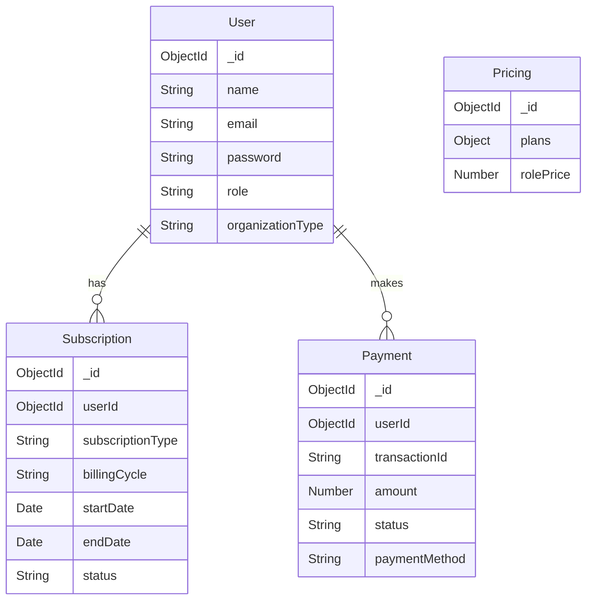

# AcadSync Architecture Documentation

This document provides a comprehensive overview of the AcadSync project architecture, including the technology stack, system design, data models, and key workflows.

## 1. High-Level Overview

AcadSync is a full-stack web application built on the **MERN** stack (MongoDB, Express.js, React, Node.js). It follows a standard Client-Server architecture where the frontend (Client) communicates with the backend (Server) via a RESTful API.

### System Diagram

```mermaid
graph TD
    Client[Client (React + Vite)]
    Server[Server (Node.js + Express)]
    DB[(MongoDB Atlas/Local)]

    Client -- HTTP Requests (Axios) --> Server
    Server -- Mongoose Queries --> DB
    DB -- JSON Data --> Server
    Server -- JSON Responses --> Client
```

## 2. Frontend Architecture (Client)

The frontend is a Single Page Application (SPA) built with React 19 and Vite.

### Technology Stack

- **Framework**: React 19
- **Build Tool**: Vite
- **Language**: TypeScript
- **Styling**: Tailwind CSS 4
- **Routing**: React Router DOM 7
- **State Management**: React Context API
- **HTTP Client**: Axios

### Directory Structure

- **`src/components`**: Reusable UI components (Buttons, Inputs, Modals).
- **`src/pages`**: Top-level page components mapped to routes.
- **`src/context`**: Global state providers.
  - `AuthContext`: Manages user authentication state (user, token, login/logout).
  - `SubscriptionContext`: Handles subscription data and status.
  - `PricingContext`: Managing dynamic pricing calculations on the frontend.
  - `ThemeContext`: Dark/Light mode toggle.
- **`src/hooks`**: Custom hooks for logic reuse (e.g., `useAuth`, `useSubscription`).
- **`src/services`**: API integration layer. `api.ts` configures the Axios instance with interceptors for token handling.

### Key Workflows

1.  **Authentication**:
    - User logs in via `/login`.
    - JWT token is received and stored in `localStorage`.
    - `AuthContext` updates state to `isAuthenticated`.
    - Axios interceptor attaches the token to subsequent requests.

2.  **Dashboard Routing**:
    - Protected routes check `AuthContext`.
    - Based on `user.organizationType` or subscription roles, users are redirected to specific dashboards (e.g., `/student`, `/teacher`, `/admin`).

## 3. Backend Architecture (Server)

The backend is a REST API service built with Node.js and Express.

### Technology Stack

- **Runtime**: Node.js
- **Framework**: Express.js 5
- **Language**: TypeScript
- **Database**: MongoDB (via Mongoose)
- **Security**: Helmet, CORS, Express Rate Limit, Bcrypt, JWT

### Architectural Pattern

The server follows a standardized **MVC (Model-View-Controller)** pattern (minus the View, as it's an API).

- **Routes** (`src/routes`): Define API endpoints and map them to controller methods. Middleware is applied here.
- **Controllers** (`src/controllers`): Handle request logic, validation, and sending responses.
- **Services** (`src/services`): Encapsulate business logic (e.g., `pricing.service.ts` for complex calculations).
- **Models** (`src/models`): Mongoose schemas defining data structure and validation.
- **Middleware** (`src/middleware`):
  - `auth.middleware.ts`: Verifies JWT tokens and protects routes.
  - `rateLimit.ts`: Protects against DDoS and brute-force attacks.

### Database Schema (MongoDB)

The database relations are defined using Mongoose references.



- **User**: Core identity. Stores profile and role.
- **Subscription**: Tracks the active plan, billing cycle, and validity period. Linked to `User`.
- **Payment**: Audit trail of all transactions. Linked to `User`.
- **Pricing**: Singleton configuration document used to calculate dynamic prices.

## 4. Key Design Decisions

- **Dynamic Pricing**: Pricing logic is centralized in the backend (`Pricing` model and service) but exposed via an API so the frontend wizard can calculate costs in real-time.
- **Role-Based Access Control (RBAC)**:
  - **Frontend**: `ProtectedRoute` component restricts access to pages.
  - **Backend**: `protect` middleware verifies identity, and `admin` middleware restricts sensitive routes.
- **Scalability**:
  - The backend is stateless (JWT auth), allowing for horizontal scaling.
  - Database queries are optimized with indexing (though default Mongoose indexing is used for now).

## 5. Deployment

- **Client**: Can be deployed to static hosts (Vercel, Netlify) as a built SPA.
- **Server**: Deployed to Node.js environments (Render, Heroku, AWS EC2).
- **Database**: MongoDB Atlas is the recommended cloud database provider.
